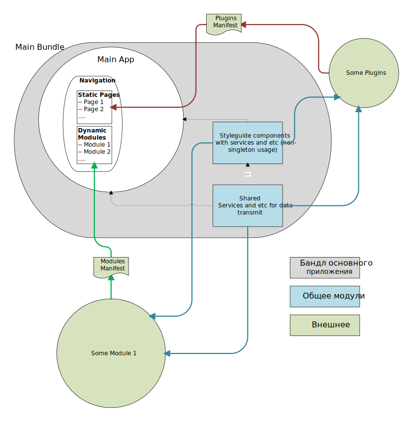
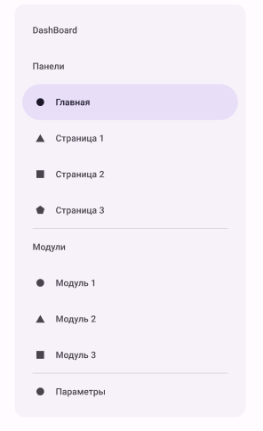
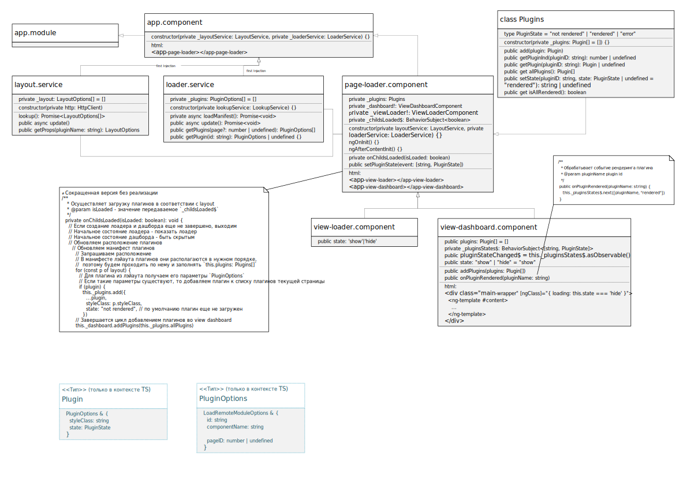

# Архитектура проекта

## General Structure

Общая структура раздляется условно на две части -- Некоторое основное приложение `Some App` (слева от вертикальной пунктирной линии), и `Dashboard` (справа от пунктирной линии). 

Первая часть - Основное приложение. Оно содержит в себе все необходимые для его внутренней работы компоненты (на них сейчас подробно останавливаться необходимости нет), а также содержит загрузчик внешних модулей `Modules Loader`. Загрузчик импортирует манифест, в котором описаны все необходимые для загрузки модули. 

Вторая часть - `Dashboard` (Дашборд), манифест, в котором описаны плагины, общие библиотеки. Дашборд представляет собой типичный Внешний модуль, который может импортироваться в какое-либо приложение, при этом сам дашборд через некий загрузчик импортирует в себя плагины (при помощи манифеста). Дашборд располагает внутри себя плагины согласно описанию в специальном манифесте, который также может загружаться извне. Вся вторая часть будет условно назваться Дашборд. 



Основную структуру Дашборда и его внешних элементом можно представить в виде дерева папок:
```
+-- Application/
+--     /Projects
+--         dashboard/
+--         styleguide-lib/
+--         shared-lib/
+--         some-mfe-plugins/
```

### Styleguide components

`styleguide` - это библиотека (`lib`), представляющая собой набор компонетов и необходимых для их работы сервисов, которые НЕ работают как синглтоны. Они могут использоваться в основном приложении, а также во внешних модулях и компонентах. Их работа достигается путем НЕ включения этой библиотеки внутри `webpack.config`, что позволяет дублировать их сколько угодно.

### Shared

`shared` - библиотека, которая включается в `webpack.config` и ее составляющие таким образом импортируются как синглтоны внутри всех проектов. Благодаря ей можно обмениваться данными между основным приложеним и внешними модулями и компонентами.

### Main App

Концепт основного приложения (см. [основную структуру](#general-structure)):

Пример навигации:



В случае наличия защищенных модулей их список должен получается, но сами модули не создаются. Модули будут загружены и созданы только после того, как пользователь авторизируется корректно.

Модули и компоненты lazy подгружаются при переходе на соответствующую страницу.

## Dashboard

Структура Dashboard



