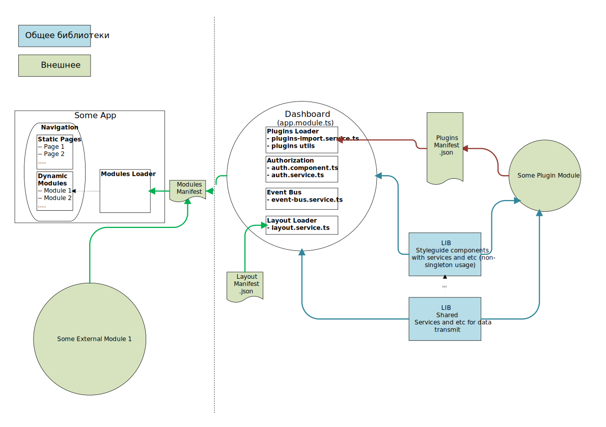
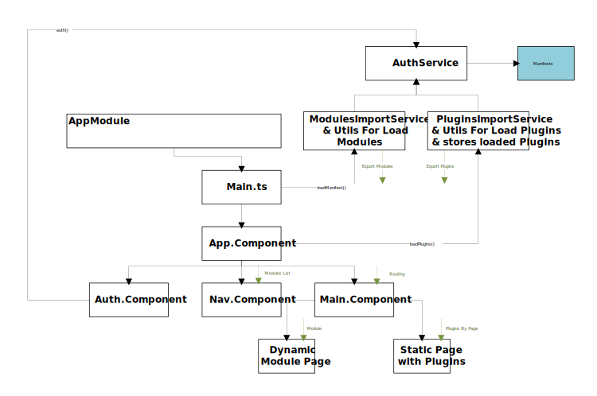

# Архитектура проекта

## General Structure

Пояснения по схеме:
- Общие модули - ангуляр библиотеки (`lib`)



Основную структуру можно представить в виде дерева папок:
```
+-- Application/
+--     /Projects
+--         shell/
+--         styleguide/
+--         shared/
+--         mfe-module/
+--         mfe-plugins/
```

### Main Bundle

Основной бандл приложения включает в себя `shell` и общие компоненты `styleguide` и `shared`.

### Styleguide components

`styleguide` - это библиотека (`lib`), представляющая собой набор компонетов и необходимых для их работы сервисов, которые НЕ работают как синглтоны. Они могут использоваться в основном приложении, а также во внешних модулях и компонентах. Их работа достигается путем НЕ включения этой библиотеки внутри `webpack.config`, что позволяет дублировать их сколько угодно.

### Shared

`shared` - библиотека, которая включается в `webpack.config` и ее составляющие таким образом импортируются как синглтоны внутри всех проектов. Благодаря ей можно обмениваться данными между основным приложеним и внешними модулями и компонентами.

### Main App

Концепт основного приложения (см. [основную структуру](#general-structure)):

Основное приложение подгружает манифесты модулей и компонентов и с ними подгружает внешние модули при старте. Внешние компоненты будут подгружены после перехода на соответсвтующую страницу. Основное приложение разделяется на статические страницы, на которых находятся компоненты основного приложения и подгружаемые внешние компоненты, а также динамические страницы, которые представляют собой внешние модули. Список динамических модулей получается из манифеста и этим списоком дополняется навигация в подразедле. 

Пример навигации:


В случае наличия защищенных модулей их список должен получается, но сами модули не создаются. Модули будут загружены и созданы только после того, как пользователь авторизируется корректно.

Модули и компоненты lazy подгружаются при переходе на соответствующую страницу.

Пример структуры `shell`:



